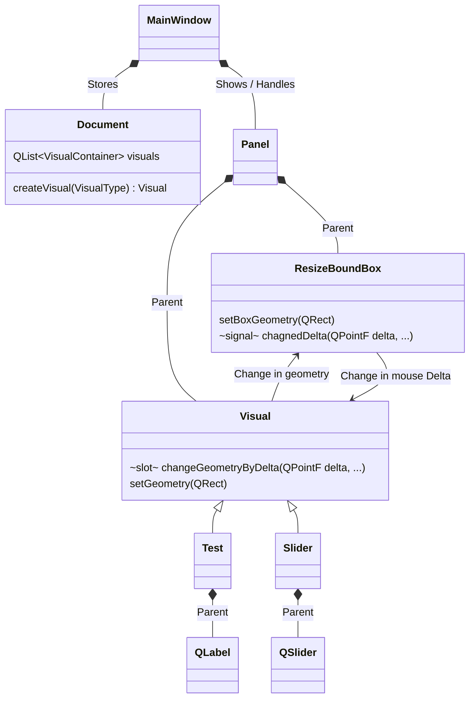

# Developer manuel

## Debug Mode
The application has a few more tools if build as debug. The Macro `QT_DEBUG` is used to specify if the application builds as debug.

### Additional Shortcuts
- `Esc`: Quit the application

## Panels
The *Panel* is a fundamental concept of Skui.
It is organised the following way:

## CoreNode vs. UINode 
A *Visual* 